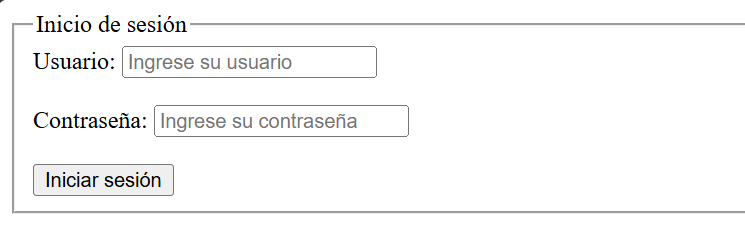
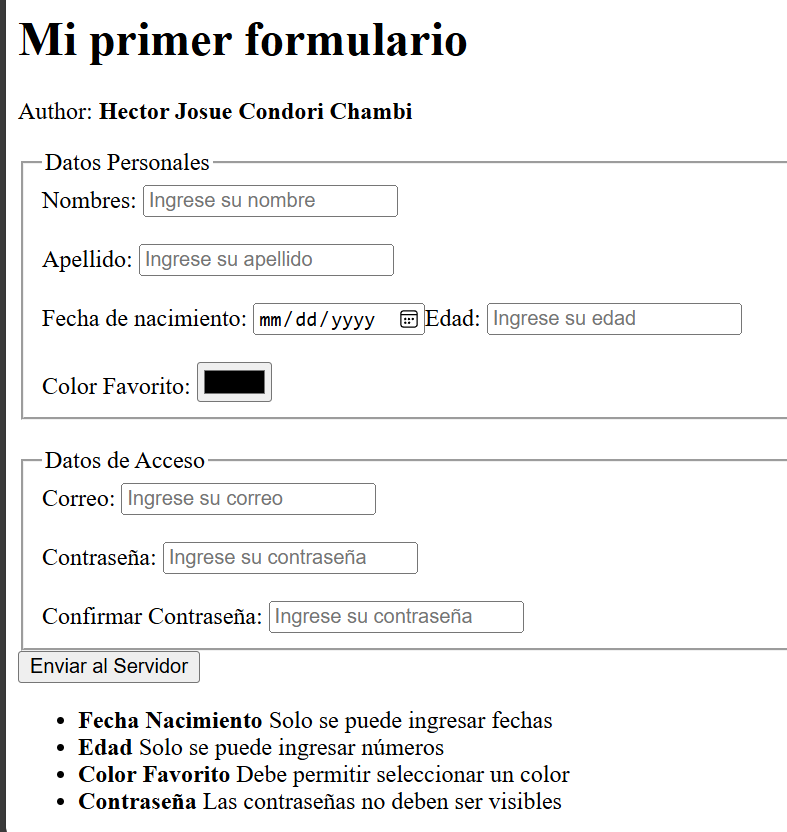

import { FileTree } from "@astrojs/starlight/components"
import {Card} from "@astrojs/starlight/components"

En esta seccion aprenderemos a crear un documento HTML básico. El primer proyecto haremos una pagina web de un **login**
<Card title="Realizaremos esta pagina">


</Card>


:::note
Si tiene conocimiento en `CSS` es libre de agregar estilos a su gusto. En este tutorial solo nos enfocaremos en la estructura HTML, por tanto evitaremos usar estilos.
:::


## Estructura base.
Como ya vimos en la [seccion anterior](/guides/02-html#estructura-base-de-un-documento-html), usaremo dicha estructura basica.
```html
<!DOCTYPE html>
<html lang="es">
    <head>
        <title>Mi primer login</title>
    </head>

    <body>
        <!-- Contenido visible de la página -->
    </body>
</html>
```

## Cargando icono para la pagina.
Para cargar un icono en la pestaña del navegador, usamos la etiqueta `<link>` con el atributo `rel="icon"` y `href` que indica la ruta del archivo de la imagen.
El icono puede ser un recurso local o un recurso externo.
- **Local** Cuando el icono se encuentra en la misma carpeta que el archivo HTML.
- **Externo** Cuando el icono se encuentra en un servidor externo, se usa el enlace de la imagen.
:::note
Si el icono que va a usar es un recurso local, asegurese de que el archivo de la imagen tenga el nombre `favicon.ico` y que se encuentre en la misma carpeta que el archivo HTML. ejemplo:
<FileTree>
- TuCarpeta
    - index.html
    - favicon.ico
</FileTree>

:::
```html ins={3}
<head>
    <title>Mi primer login</title>
    <link rel="icon" href="favicon.ico">
</head>
```
Con esto deberiamos visualizar el icono en la pestaña del navegador.


## Errores en los caracteres especiales.

## La etiqueta `<form>`
[Con contenido](/guides/02-html/#etiquetas-con-contenido)(con cierre)

La etiqueta `<form>` se usa para crear un formulario en HTML. Esta etiqueta tiene varios atributos, como `action`, `method`, `enctype`, etc., que se utilizan para enviar los datos del formulario a un servidor.

En este caso no usaremos estos atributos, solo crearemos un formulario simple con dos campos de entrada y un botón de envío.
```html
<body>
    <form>
        <!-- Campos de entrada y botón de envío -->
    </form>
</body>
```
No se visualizara nada en el navegador, ya que no hemos agregado contenido al formulario.

## Etiquetas  `<input>` y `<label>`
- `<input>` [Cin contenido](/guides/02-html/#etiquetas-sin-contenido)(sin cierre)
- `<label>` [Con contenido](/guides/02-html/#etiquetas-con-contenido)(con cierre)

Las etiqueta `input` se usa para crear campos de entrada en un formulario(Texto de entrada). y tiene varios atributos, algunos atributos que se pueden visualizar son: 
- `type` que indica el tipo de campo de entrada, puede ser `text`, `password`, `email`, `number`, etc.
- `placeholder` que muestra un texto de ayuda en el campo de entrada.
- `id` que es el identificador único del campo de entrada(no visible).

La etiqueta `label` usualmente se usan en conjunto con la etiqueta `input` para proporcionar una descripción del campo de entrada. Usaremos los siguientes atributos:
- `for` que indica el `id` del campo de entrada al que se refiere.

```html ins={2-6}
<form>
    <!-- Campo usuario -->
    <label for="username">Usuario:</label>
    <input type="text" id="username" placeholder="Ingrese su usuario">

    <!-- Campo contraseña -->
    <label for="password">Contraseña:</label>
    <input type="password" id="password" placeholder="Ingrese su contraseña">
</form>
```
:::note
Es comun usar los `id` en **ingles** para identificar los campos de entrada. Debido a que es un estandar en la programacion.
:::

Ahora podra ver los resultados en el navegador. Sin embargo, la estructura de la pagina no es muy atractiva, comunmente los formularios tienes las entradas(`inputs`) en multiples lineas.
En la siguiente seccion aprenderemos a organizar los elementos del formulario.

## Saltos de linea y contenedores `<div>` y `<br>`
- `<div>` [Con contenido](/guides/02-html/#etiquetas-con-contenido)(con cierre)
- `<br>` [Sin contenido](/guides/02-html/#etiquetas-sin-contenido)(sin cierre)

Para hacer un salto de linea entre las entradas `username` y `password`, usamos la etiqueta `<br>`. Esta etiqueta no tiene contenido, solo se usa para hacer un salto de linea.

```html {5, 9}
<form>
    <!-- Campo usuario -->
    <label for="username">Usuario:</label>
    <input type="text" id="username" placeholder="Ingrese su usuario">
    <br>
    <!-- Campo contraseña -->
    <label for="password">Contraseña:</label>
    <input type="password" id="password" placeholder="Ingrese su contraseña">
    <br>
</form>
```
Ahora las entradas se visualizan en lineas separadas. Otra alternativa mas recomendada es usar la etiqueta `<div>` que se usa para agrupar elementos en un contenedor. Esta etiqueta tiene varios atributos, pero en este caso no los usaremos.

```html ins={2,6,8,12} {2-6, 8-12}
<form>
    <div>
        <!-- Campo usuario -->
        <label for="username">Usuario:</label>
        <input type="text" id="username" placeholder="Ingrese su usuario">
    </div>

    <div>
        <!-- Campo contraseña -->
        <label for="password">Contraseña:</label>
        <input type="password" id="password" placeholder="Ingrese su contraseña">
    </div>
</form>
```
Note que nos da el casi el mismo resultado que con la etiqueta `<br>`, en este caso no existe un espacio entre los campos de entrada a comparacion de la etiqueta `<br>`. Sin embargo, la etiqueta `<div>` es mas recomendada ya que nos permite agregar estilos y organizar mejor los elementos del formulario.

Usaremos ambas etiquetas para organizar los elementos del formulario.

```html ins={7}
<form>
    <div>
        <!-- Campo usuario -->
        <label for="username">Usuario:</label>
        <input type="text" id="username" placeholder="Ingrese su usuario">
    </div>
    <br>
    <div>
        <!-- Campo contraseña -->
        <label for="password">Contraseña:</label>
        <input type="password" id="password" placeholder="Ingrese su contraseña">
    </div>
</form>

```

## La etiqueta `<button>`
[Con contenido](/guides/02-html/#etiquetas-con-contenido)(con cierre)

La etiqueta `<button>` se usa para crear un botón en un formulario. Esta etiqueta tiene varios atributos, pero en este caso solo uramos los siguientes:
- `type` que indica el tipo de botón, puede ser `submit`, `reset`, `button`.

```html
<form>
    <div>
        <!-- Campo usuario -->
        <label for="username">Usuario:</label>
        <input type="text" id="username" placeholder="Ingrese su usuario">
    </div>
    <br>
    <div>
        <!-- Campo contraseña -->
        <label for="password">Contraseña:</label>
        <input type="password" id="password" placeholder="Ingrese su contraseña">
    </div>
    <br>
    <button type="submit">Iniciar sesión</button>
</form>

:::note
Alternativamente, puede usar la etiqueta `<input>` con el atributo `type="submit"` para crear un botón de envío.
```html
<input type="submit" value="Iniciar sesión">
``` 
:::

## La etiqueta `<fieldset>` y `<legend>`
- `<fieldset>` [Con contenido](/guides/02-html/#etiquetas-con-contenido)(con cierre)
- `<legend>` [Con contenido](/guides/02-html/#etiquetas-con-contenido)(con cierre)

La etiqueta `<fieldset>` se usa para agrupar elementos de formulario relacionados en un contenedor. Imaginelo como un `<div>` pero con elementos visibles para el usuario.


La etiqueta `<legend>` se usa dentro de la etiqueta `<fieldset>` para proporcionar una descripción del grupo de elementos del formulario.

```html
<form>
    <fieldset>
        <legend>Inicio de sesión</legend>
        <div>
            <!-- Campo usuario -->
            <label for="username">Usuario:</label>
            <input type="text" id="username" placeholder="Ingrese su usuario">
        </div>
        <br>
        <div>
            <!-- Campo contraseña -->
            <label for="password">Contraseña:</label>
            <input type="password" id="password" placeholder="Ingrese su contraseña">
        </div>
        <br>
        <button type="submit">Iniciar sesión</button>
    </fieldset>
</form>
```

## Resultado final
```html
<!DOCTYPE html>
<html lang="es">
    <head>
        <title>Mi primer login</title>
        <link rel="icon" href="favicon.ico">
    </head>

    <body>
        <form>
            <fieldset>
                <legend>Inicio de sesión</legend>
                <div>
                    <!-- Campo usuario -->
                    <label for="username">Usuario:</label>
                    <input type="text" id="username" placeholder="Ingrese su usuario">
                </div>
                <br>
                <div>
                    <!-- Campo contraseña -->
                    <label for="password">Contraseña:</label>
                    <input type="password" id="password" placeholder="Ingrese su contraseña">
                </div>
                <br>
                <button type="submit">Iniciar sesión</button>
            </fieldset>
        </form>
    </body>
</html>
```


:::tip
Para el siguiente ejercicio debes considerar lo siguiente:
- La etiqueta `<input>` tiene un atributo `type` que puede recibir diferentes valores, como ser:
    - `text` Para que acepte todo tipo de texto.
    - `password` Para que acepte texto, que no se visualice.
    - `email` Para que acepte un correo electronico.
    - `number` Para que acepte solo numeros.
    - `color` Para que acepte un color.
    - `date` Para que acepte una fecha y desplegar un calendario.
    - `file` Para que acepte un archivo.
    - ...y muchas [mas etiquetas](https://developer.mozilla.org/es/docs/Web/HTML/Element/input)    
:::


## Trabajo en clase 1
<Card title="Hazlo tu mismo" icon="star">
Realiza el siguiente formulario

</Card>